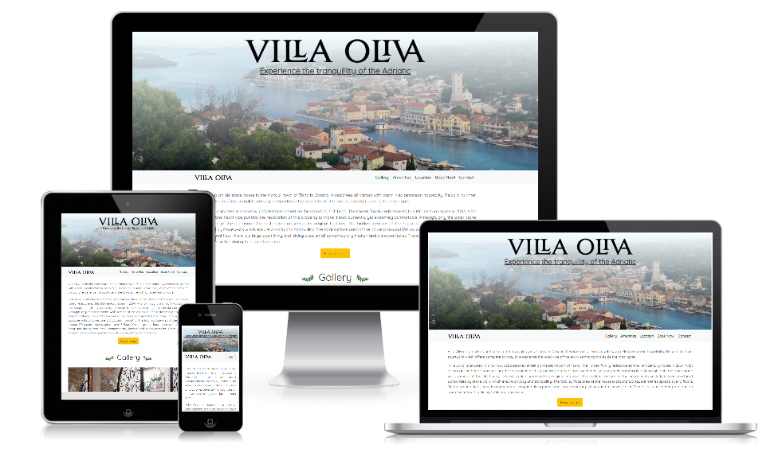
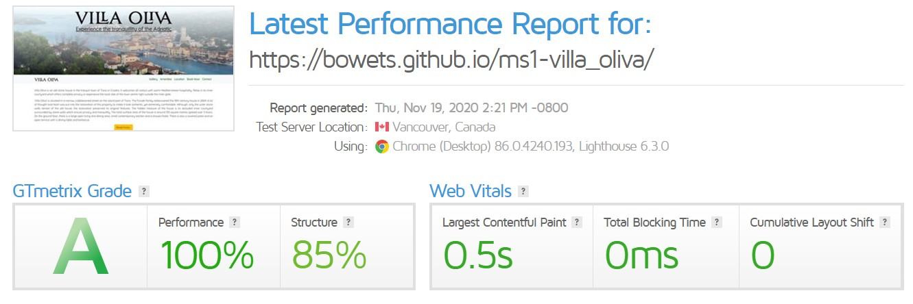
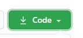

This is a website created for the purpose of completing the Milestone Project 1 for the Full Stack Software Development Diploma at Code Institute. 

The idea for this website is to promote Villa Oliva, a 18th century house located in the town of Tisno in Croatia. The house is owned by the Forsek family and listed on AirBnB to be rented out between the months of May and September. The purpose of the website is to increase bookings and SEO for Villa Oliva. Villa Oliva is a real life business and the website will provide visitors and potential guests with information about their accomodation, local points of interest and directions to find Villa Oliva. Visitors to the website will also be able to book their accomodation by being redirected to AirBnB. There is a form where potential guests and visitors to the website can ask questions or post comments, however, due to the limitation of knowledge at this stage, the form does not submit any information nor saves it to a database.  

# UX

This project is aimed at potential guests of Villa Oliva who are looking to book a house to spend their summer holidays. The house itself is designed with flow in mind and there is very little, if any clutter. This webpage tries to emulate the same design principles. The website is designed as a single scrolling page designed for mobile first. Villa Oliva relies mostlly on word of mouth advertising so creating a mobile first website was important to facilitate sharing links through social media and apps such as WhatsApp and Instagram. Since these are mobile only apps, the website must be optimized for this audience. 

## General

The website is designed as a single scrolling page where all the information is avialable by scrolling top to bottom. Where additional information is needed, modals were used to provide additional information, without adding complexity to the website. 
The website is broken down into several sections providing specific information for the users. Users can navigate to each section using the sticky navigation bar at the top of the page. Each link on the navigation bar jumps to the corresponding section in the page. 
The overall design of the website is very simple with few complications. Black text on a white background with a little bit of color and images to break up the different sections. The idea is to keep the page and design as elegant as possible. 

## User Stories

- As a user I expect to be able to quickly find the information I need

    - The website is organized as a single scrollable page with a logical flow of information. 

- As a user I want to see clean design

    - The design has a very clean design using a white background and black text. A little bit of color is used to emphasize rather than distract. 

- As a user I want to easily navigate the page

    - The navigation bar sticks to the top of the page and follows the user along as they scroll through the page. This means that at any time users can navigate to any part of the page without having to scroll to the top. 

- As a user I want to be able to book Villa Oliva

    - There is a "Book Now" section where users can check availability. There is also a "Book Now" button which opens the Villa Oliva AirBnB page in a new window / tab. 

- As a user I want to view the page on all screen sizes

    - The website is designed as a responsive website which scales depending on the size of the screen it is viewed on. 

## Wireframes

[Homepage Wireframe](assets/readme/wireframe_home_page.png)

[History - Sample Page Wireframe](assets/readme/wireframe_history.png)

The wireframes were designed at the begining of the project. The original concept was to have multiple pages for each of the sections on the webpage which would provide more information. However, to make browsing simpler and to allow users better and quicker access to the information, a single page design was chosen. Therefore, the wireframes do not completely match the finished website. 

# Features

## Villa Oliva

This section provides information on the house, its history and what guests can expect when visiting. A small excerpt is available on the main page and if potential guests are interested in additional information about the house, they can click "read more" which will open up a modal with additinal information and a photo of the outside of the building. 

## Gallery

Visual media is the best way to show potential guests what to expect when booking accomodation. For this reason, a gallery is included to show the property, the rooms and sorrounding area. To keep in line with the simple design, all photos are displayed in a carrousell. There are 13 photos of the property which cycle automatically every 5 seconds between images. If a site visitor would like to go through all the photos manually, they can click the right or left side of the image to move forward or backward. 

## Amenities

The amenities section provides information on what is avaialble for guests of Villa Oliva. FontAwesome was used to provide visual information for each amenity as well as a text description. 

The amenities section is responsive so that it has equal impact on both mobile, tablet and desktop. On smaller screens, designed for scrolling, amenities will be displayed in two columns. On desktops, they are ordered in two rows to spread them horizontally. 

## Location

As this website is aimed at travelers, a location section let's them know where the house is located. There is a short description of the town Tisno so that potential guests get an idea of the place they are visiting. Also, this section features a responsive google map with a pin showing the location of the house. The map will become bigger or smaller depending on the width of the screen it is displayd on. Furthermore, there are two links to points of interest for those who would like to know what they can see and experience around the location and also "directions" which explains how to get to Villa Oliva. Both "Points of Interest" and "Directions" open in modals to keep in line with the simple design. 

## Book Now

This section is a call to action for site visitors to transition from being potential guests to actually booking their stay. 
There is a responsive calendar which shows availability of Villa Oliva and a Book Now link which will redirect visitors to the AirBnB page for Villa Oliva. 
Due to current limitations in programming knowledge, redirecting visitors to AirBnB is the best way to ensure bookings. In the future, it will be possible to create a full booking engine for Villa Oliva. 

## Contact Us

If visitors to the site have any questions or comments, the "Contact Us" sections provides them with the option to reach out to the owners and get additional information. 

The "Contact Us" section is a form where users are expected to provide a name, email, define the type of query and write a full question or comment. 
The form requires the user to input a name and email. The fields validate whether a user has provided information and in the case of emails, whether they have formatted the email correctly. 

## Features left to implement
At the moment the book now button links to an external website (AirBnB), however, in the future the plan is to create a booking engine directly in the website. 

# Technologies Used

## [HTML](https://www.w3.org/standards/webdesign/htmlcss) 
Hypertext Markup Language (HTML) is the basic building block of this website. Used for the basic design and structure of the page. 

## [CSS](https://www.w3.org/standards/webdesign/htmlcss) 
Cascading Style Sheets (CSS) is used to style the design elements and media queries are used to make the site responsive.  

## [Bootstrap 4](https://getbootstrap.com/)
Bootstrap is used to make the website responsive on multiple screen sizes. 

## [Visual Studio Code](https://code.visualstudio.com/)
Microsoft Visual Studio Code is an Integrated Development Environment (IDE) used to develop software. 

## [Git](https://git-scm.com/)
Git was used alongside Visual Studio Code as a local version control platform. All commits were regularly pushed to GitHub. 

## [GTmetrix](https://gtmetrix.com/)
GTmetrix is an online service used to evaluate the load time and performance of websites. 

## [Pixabay](https://pixabay.com/)
Pixabay is an online repository of free images. 

## [Google Fonts](https://fonts.google.com/)
Google Fonts is a repository of free to use fonts. The fonts used in this project are 'Cinzel' and 'Quicksand'

## [FontAwesome](https://fontawesome.com/)
Fontawesome is a vector icon repository. In this project fontawesome icons are used in the "Amenities" section to ilustrate the amenities available and in the "Directions" modal to emphasize the transport options. 

## [Paint.net](https://www.getpaint.net/)
Paint(dot)net is a free photo editing software. In this project it was used to style and resize images. 

## [Google Chrome](https://www.google.com/intl/en_ie/chrome/)
Google Chrome is a web browser developed by Google Inc. In this project Google Chrome was used extensivelly along with Microsoft Edge to preview and test the project with the chrome developer tools.

## [Microsoft Edge](https://www.microsoft.com/en-us/edge)
Microsoft Edge is a web browser developed by Microsoft. In this project Microsoft Edge was used extensivelly along with Google Chrome to preview and test the project with the chrome developer tools.

## [Markdown Table Generator](https://www.tablesgenerator.com/markdown_tables#)
The Markdown Table Generator was used to generate the tables in the readme to display the texting matrix. 

# Testing

## Performance testing
To test the performance and loading time of the website, the project was submitted to GTmetrix. The score returned was 100% performance. 

## Testing Methodology
The site was tested on multiple browsers and physical devices. The following methodology was applied:

1. Do all links work?
    - Click all links on the page to ensure they are not broken

2.  Is the navigation bar responsibe and "sticks" to the top of the screen?
    - The navigation bar should collapse into a toggle button on smaller screens and expand on larger screens. It should also, stick to the top of the viewport when scrolling. 

3. Do all modals open and have close buttons?
    - Test all modals

4. Does the form work as intended?
    - Do all inputs set to required work and does the email field require the user to format the input as an email address. 

5. Does the "book now" button work?
    - Does it open up the Villa Oliva AirBnB page in a new tab / window? 

6. Does the gallery work?
    - Are all photos displayed
    - Can the user navigate through the photos

7. Is the page responsive?
    - Does the page and all elements within it resize depending on screen size

## Browser Testing

The project was tested in several browsers and the results are displayed in the table below. The browsers used are in the first column and the methodology is in the first row (in order as above)

|   	| 1.	| 2.  	| 3.  	| 4.  	| 5.  	| 6.  	| 7.  	|
|---	|---	|---	|---	|---	|---	|---	|---	|
|Google Chrome   	|Yes   	|Yes   	|Yes   	|Yes   	|Yes   	|Yes   	|Yes  	|
|Microsoft Edge   	|Yes   	|Yes   	|Yes   	|Yes   	|Yes   	|Yes   	|Yes   	|
|Safari   	|Yes   	|Yes   	|Yes   	|Yes   	|Yes   	|Yes   	|Yes   	|
|Mozilla Firefox   	|Yes   	|Yes   	|Yes   	|Yes   	|Yes   	|Yes   	|Yes   	|
|Opera   	|Yes   	|Yes   	|Yes   	|Yes   	|Yes   	|Yes   	|Yes   	|
|Internet Explorer   	|Yes   	|**No**   	|Yes   	|Yes   	|Yes   	|Yes   	|Yes   	|

All testing was successfull, except the navigation bar on Internet Explorer. 
The navigation bar does not "stick" to the top of the viewport when scrolling. It is fully functional and responsive, but when the user scrolls past the navigation bar, it does not follow the user down the page. 

### IE Sticky bug
When the bug was discovered, I researched the web and found out I would need to use javascript to correct this. Due to not being proficient in javascript and the bug not having much impact on the user experience over all, I decided to keep the fix for another day. This is unlikely to affect many people so the cost of fixing it is higher than the value at this time. 

## Device testing
The website was also tested on multiple devices both physical and virtual (using Chrome and Edge developer tools)

| Device   	| Type  	| 1.  	| 2.  	| 3.  	| 4.  	| 5.  	| 6.  	| 7.    |
|---	|---	|---	|---	|---	|---	|---	|---	|---    |
|Asus Zenbook   |Physical Laptop	| Yes  	| Yes  	| Yes  	|  Yes 	| Yes  	| Yes  	| Yes      |
|Samsung S10e   	|Physical Mobile Phone   	| Yes  	| Yes  	| Yes  	| Yes  	| Yes  	| Yes  	| Yes      |
|OnePlus Nord   	|Physical Mobile Phone   	| Yes  	| Yes  	| Yes  	| Yes  	| Yes  	| Yes  	| Yes      |
|Samsung SM-P 205   	| Physical tablet   	| Yes  	| Yes  	| Yes  	| Yes  	| Yes  	| Yes  	| Yes      |
|iPhone 5   	| Virtual - Chrome Dev Tools  	| Yes  	| Yes  	| Yes  	| Yes  	| Yes  	| Yes  	| Yes      |
|iPad   	| Virtual - Chrome Dev Tools  	| Yes  	| Yes  	| Yes  	| Yes  	| Yes  	| Yes  	| Yes      |
|iPad Mini  	| Virtual - Chrome Dev Tools  	| Yes  	| Yes  	| Yes  	| Yes  	| Yes  	| Yes  	| Yes      |
|iPad Pro  	| Virtual - Chrome Dev Tools  	| Yes  	| Yes  	| Yes  	| Yes  	| Yes  	| Yes  	| Yes      |

## Validation
HTML code was successfully validated using the [W3C Markup Validation Service](https://validator.w3.org/) and returned no errors. 
CSS code was successfully validated using the [Jigsaw W3C CSS Validation Service](https://jigsaw.w3.org/css-validator/) and returned no errors.

# Deployment

[**Villa Oliva**](https://bowets.github.io/ms1-villa_oliva/) is deployed and hosted on GitHub Pages. 

The project was developed using Visual Studio Code. Git was used as a local version control platform. All commits were regularly pushed to the GitHub repository. 

Any changes made on the project were pushed to Github and changes could have been seen immediately on the live site on Github pages. 

## Local deployment
To access this poject locally, download the project file by clicking on the green "Code" button at the top of the page.
 

You can either download a ZIP file containing the project and work on it locally or you can copy the link in the dropdown menu and pull the repository into your IDE of choice. 

# Credits
I want to credit my mentor Ignatius Ukwuoma who guided me through this project and always offered very helpful advice. 
I also want to give credit to the Code Institute Slack groups from where I was able to find answers to some of the problems I was trying to solve. 

## Inspiration
The inspiration for this project is Villa Oliva, a real world business operated by my family in Croatia. The aim of the project is to increase its online presence and convert potential visitors into return guests. 

## Media
The Kornati Islands image is a free image by [k559](https://pixabay.com/users/k559-3647966/?utm_source=link-attribution&amp;utm_medium=referral&amp;utm_campaign=image&amp;utm_content=1785556) on [Pixabay](https://pixabay.com/?utm_source=link-attribution&amp;utm_medium=referral&amp;utm_campaign=image&amp;utm_content=1785556)

The Plitvice Lakes image is a free image by [jimmmyimi](https://pixabay.com/users/jimmyimi-4537454/?utm_source=link-attribution&amp;utm_medium=referral&amp;utm_campaign=image&amp;utm_content=2061116) on [Pixabay](https://pixabay.com/?utm_source=link-attribution&amp;utm_medium=referral&amp;utm_campaign=image&amp;utm_content=1785556)

The [olive branch](assets/img/olive-branch-right.jpg) images are royalty free images from [clipartmax](https://www.clipartmax.com/middle/m2H7i8N4m2G6A0i8_tree-branch-clip-art-at-clipartimage-olive-branch-clipart-black-and-white/)

All other images are my own or owned by Villa Oliva.

## Content
The content for the "Points of Interest" section was paraphrased from [wikipedia](https://www.wikipedia.org/)

All other content is original. 

## Code credits
The code to create the google map and google calendar iframse responsive was taken from an online article [How to Make Google Maps Embeds Responsive](https://www.labnol.org/internet/embed-responsive-google-maps/28333/)

